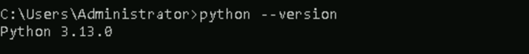

# **Set up a Python development environment and write your first Python script**

## **Table of Contents**

- [**Introduction**](#Introduction)  
- [**Problem Statement**](#problem-statement) 
- [**Prerequisites**](#Prerequisites)
  - [**SoftwareRequirement**](#software-requirement)  
  - [**Hardware Requirement**](#hardware-requirement) 
- [**Setting up a Python Environment**](#Setting-up-a-Python-Environment) 
  - [**Step 1: Download the Python Installer**](#step-1-download-the-python-installer)  
  - [**Step 2: Run the Installer**](#step-2-run-the-installer)  
  - [**Step 3: Choose the Optional Installation Features**](#step-3-choose-the-optional-installation-features)  
  - [**Step 4: Choosing Advanced Options**](#step-4-choosing-advanced-options)  
  - [**Step 5: Final Setup**](#step-5-final-setup)  
  - [**Step 6: Add Python to Path (Optional)**](#step-6-add-python-to-path-optional)  
  - [**Step 7: Verify Python Was Installed on Windows**](#step-7-verify-python-was-installed-on-windows)  
  - [**Step 8: Connect VS Code with Python**](#step-8-connect-vs-code-with-python)  
    - [**Installing Visual Studio Code**](#installing-visual-studio-code)  
    - [**Install the Python Extension for VS Code**](#install-the-python-extension-for-vs-code)  
    - [**Create a Python File and Write the Script**](#create-a-python-file-and-write-the-script)  
    - [**Run Your Python Script**](#run-your-python-script)    
- [**References**](#references)  

---

## **Introduction**

This guide will walk you through setting up a Python development environment on a Windows machine and writing your first Python script. The aim is to ensure that you have the essential tools installed and know how to run Python programs effectively.

---

## **Problem Statement**

Setting up a Python environment on Windows might seem challenging for beginners. This guide simplifies the process, covering installation, folder structure creation, package installation, and running a basic script.

---

## **Prerequisites**

### **Software Requirement**

Before proceeding, make sure you have the following software installed:

- **Python 3.13.0**  
   [Download Python](https://www.python.org/downloads/)
   
- **Code Editor**  
   You can choose any code editor, but **Visual Studio Code (VS Code)** is recommended for its ease of use and Python support.  
   [Download VS Code](https://code.visualstudio.com/Download)


- **Python packages (installed via `pip`)**  
   We will cover installation of necessary packages in a later step.

---

### **Hardware Requirement**

You don't need high-end hardware to run Python, but make sure your machine meets the following basic requirements:

- **Processor:** 1 GHz or faster, 2-core CPU.
- **Memory:** 4 GB (8 GB recommended for better performance)
- **Storage:** 1 GB of free space for Python installation (additional space for projects and dependencies).
- **Operating System:** Windows 10 or higher.

---

## **Setting up a Python Environment**

### **Step 1: Download the Python Installer:**

   

   - Visit the [official Python website](https://www.python.org/downloads/).
   - Click on the yellow **"Download Python 3.13.0"** button (the latest stable version will be shown).
   

---

### **Step 2: Run the Installer:**

   1. Run the downloaded Python Installer.

   2. The installation window shows two checkboxes:

      - **Admin privileges:** The parameter controls whether to install Python for the current or all system users. This option allows you to change the installation folder for Python.

      - **Add Python to PATH:** The second option places the executable in the PATH variable after installation. You can also add Python to the PATH environment variable manually later.

      
      <br>

   3. Select the **Install Now** option for the recommended installation (in that case, skip the next two steps).

   4. To adjust the default installation options, choose **Customize installation** instead and proceed to the following step.

   - **Installation Directory:** `C:\Users\[user]\AppData\Local\Programs\Python\Python[version]`

   - **Included Components:**
     - **IDLE** (the default Python Integrated Development and Learning Environment).
     - **PIP** (Python's package installer).
     - **Additional Documentation.**
     
   - The installer also creates:
     - Required shortcuts.
     - File associations for `.py` files.

   If you choose the **"Customize Installation"** option during setup, you can modify the default configurations, such as the installation location, optional features, and advanced settings. This flexibility allows you to tailor the setup to your specific project requirements or environment.

---


### **Step 3: Choose the optional installation features**
   - Python works without these features, but adding them improves the program's usability.

   .JPG)

   - Click Next to proceed to the Advanced Options screen.

---

### **Step 4: Choosing advanced options**

   - Choose whether to install Python for all users. The option changes the install location to C:\Program Files\Python[version]. 

   - If selecting the location manually, a common choice is C:\Python[version] because it avoids spaces in the path, and all users can access it.Due to administrative rights, both paths may cause issues during package installation.
  
   .JPG)
   <br>

   After picking the appropriate options, click Install to start the installation.
   <br>

   .JPG)


---
<br>

### **Step 5: Final Setup**

   - Select whether to disable the path length limit. Choosing this option will allow Python to bypass the 260-character MAX_PATH limit.

   
   <br>

   - The option will not affect any other system settings, and disabling it resolves potential name-length issues. We recommend selecting the option and closing the setup.

---

<br>

### **Step 6: Add Python to Path (Optional)**

If the Python installer does not include the Add Python to PATH checkbox or you have not selected that option, continue in this step. Otherwise, skip to the next step.

To add Python to PATH, do the following:

#### 1. In the **Start menu**, search for **Environment Variables** and press **Enter**.


<br>

#### 2. Click **Environment Variables** to open the overview screen.


<br>

#### 3. Double-click **Path** on the list to edit it.


Alternatively, select the variable and click the Edit button.
<br>


#### 4. Double-click the first empty field and paste the Python installation folder path for both system and user environmental variables for Administration.


Alternatively, click the **New button** instead and paste the path. Click **OK** to save the changes.
<br>

---

### **Step 7: Verify Python Was Installed on Windows**

The first way to verify that Python was installed successfully is through the command line. Open the command prompt and run the following command:

```bash
python --version
```
<br>



The output shows the installed Python version.
<br>

**Verify PIP Was Installed**

To verify whether PIP was installed, enter the following command in the command prompt:

```bash
pip --version
```


If it was installed successfully, you should see the PIP version number, the executable path, and the Python version:


<br>

PIP has not been installed yet if you get the following output:

```
'pip' is not recognized as an internal or external command,
Operable program or batch file.
```

---


### **Step 8: Connect VScode with Python**

To set up Visual Studio Code (VS Code) with Python, follow these steps:

#### **Installing Visual Studio Code**

-  **Install Visual Studio Code:**
   - Download and install the latest version of [Visual Studio Code](https://code.visualstudio.com/Download) for your operating system.

   - The file will be downloaded onto your system. Open the file and then click on Install.

   


-	**Now accept the license agreement.**

   

-	**Then it prompts for the file location, where you want to save the VS Code file. Browse the location and then click on Next.**

   

-	**The next prompt is how you want the VS Code on your startup. Change according to your convenience and click on Next.**

   


-	**Next, you see the prompt for the additional task which we want the VS Code to perform. At this step, choose the default settings and then click on next.**

   


-	**Click on install , the installation of VS Code will now begin.**

   

  
   

-	**At this step, we have completed installing VS Code, click on Finish.**

   


-	**Now that VS Code installation is successful, the page appears as below:**

   
   
---

#### **Install the Python Extension for VS Code:**
   - Open VS Code.
   - Go to the **Extensions** view by clicking on the square icon in the left sidebar or pressing `Ctrl+Shift+X`.

   

   - Search for the **Python** extension by Microsoft.


   


   - Click **Install** to add the extension to your VS Code.
   <br>

---

#### **Create a Python File and Write the Script**

- **Create a Python File:**

   - Open a new file in your workspace.

   - Save it with the `.py` extension (e.g., `modal.py`).
   <br>


      


- **Write the Script**:

   - In the file, write the following simple script(e.g., `modal.py`):

     ```python
     # First Python script
     print("Hello, World!")
     ```
    

- **Save the File**:

   - Save the file (`Ctrl + S`).

---

#### **Run Your Python Script**

   - **Using VS Code**:

      - Press `F5` or right-click the code and select **Run Python File in Terminal**.
     
      - The terminal at the bottom will execute the script, and you should see the output:

      **Output:**
     
     

---

## **References**

- [Python Official Documentation](https://docs.python.org/3/)
- [VS Code Python Extension](https://code.visualstudio.com/docs/languages/python)

---