# **Implement Basic Data Structures (Lists, Tuples, Dictionaries) and Manipulate Them**

## **Table of Contents**

- [**Introduction**](#Introduction)  
- [**Problem Statement**](#problem-statement) 
- [**Prerequisites**](#Prerequisites)
  - [**Software Requirement**](#software-requirement)  
  - [**Hardware Requirement**](#hardware-requirement)  
- [**Implementation Steps**](#implementation-steps)  
   - [**1. Lists**](#1-lists)
   - [**2. Tuples**](#2-tuples)
   - [**3. Dictionaries**](#3-dictionaries)
- [**References**](#references)  

---

## **Introduction**

This guide will cover basic Python data structures: lists, tuples, and dictionaries. These structures are commonly used to store and manipulate data in Python. By following the steps in this guide, you will learn how to implement and work with these structures effectively.

---

## **Problem Statement**

Data structures such as lists, tuples, and dictionaries form the backbone of Python programming, especially when dealing with collections of data. Understanding how to implement and manipulate them is critical for efficient coding.

---

## **Prerequisites**

### **Software Requirement**

Make sure you have the following software installed on your system:

- **Python 3.13.0**  
   [Download Python](https://www.python.org/downloads/)

- **Code Editor**  
   A text editor or IDE like **Visual Studio Code (VS Code)** is recommended.  
   [Download VS Code](https://code.visualstudio.com/Download)

---

### **Hardware Requirement**

Python development does not require high-end hardware, but it helps to have a machine that meets the following specifications:

- **Processor:** 1 GHz or faster CPU (dual-core recommended)
- **Memory:** 2 GB RAM minimum (4 GB or higher recommended for larger projects)
- **Storage:** 1 GB of free disk space for Python installation and project files
- **Operating System:** Windows 10 or higher

---


## **Implementation Steps**


### **1. Lists**
------------

A list is a mutable (modifiable) collection of items in Python. Lists can hold items of different data types and are defined using square brackets `[]`.

   - [**Creation**](#creation)
   - [**Accessing / Indexing**](#accessing--indexing)
   - [**Slicing**](#slicing)
   - [**Length**](#length)
   - [**List Methods**](#list-methods)
      - [**append()**](#append)
      - [**clear()**](#clear)
      - [**copy()**](#copy)
      - [**count()**](#count)
      - [**extend()**](#extend)
      - [**index()**](#index)
      - [**insert()**](#insert)
      - [**pop()**](#pop)
      - [**remove()**](#remove)
      - [**reverse()**](#reverse)
      - [**sort()**](#sort)


#### **Creation**

Creating a list initializes it with specified elements.  

```python
L = ['yellow', 'red', 'blue', 'green', 'black']
print(L)
```

**Output:**

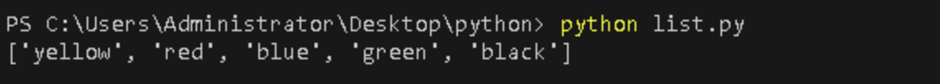

This code creates a list of colors named `L` and prints it.  


#### **Accessing / Indexing**

Accessing an element in a list refers to retrieving a specific item using its index.  

```python
L = ['yellow', 'red', 'blue', 'green', 'black']
index = L[0]
print(index)
```
**Output:**

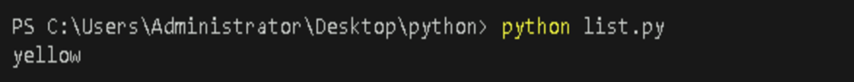

This accesses the first element of the list `L`.  


#### **Slicing**

Slicing allows you to obtain a subset of elements from the list by specifying a range of indices.  

```python
L = ['yellow', 'red', 'blue', 'green', 'black']
s = L[1:4]  
print(s)
```
**Output:**

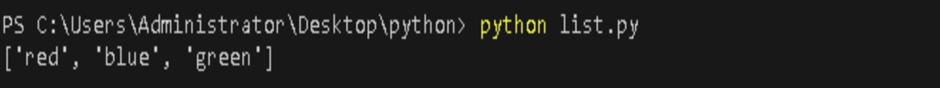

This retrieves a subset of the list `L` from index 1 to 3.

#### **Length**

The length function returns the total number of items present in the list.  

```python
L = ['yellow', 'red', 'blue', 'green', 'black']
list_length = len(L)
print(list_length)
```
**Output:**

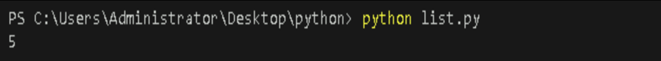

This returns the total number of items in the list `L`.  


### **List Methods**

Here are some common methods for manipulating lists:

#### **append()**

Adds an element at the end of the list.

```python
L = ['yellow', 'red', 'blue', 'green', 'black']
L.append("pink")
print(L)
```
**Output:**

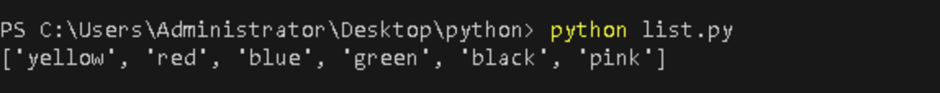

 This adds `"pink"` to the end of the list `L`.  
    

#### **clear()**

Removes all the elements from the list.

```python
L = ['yellow', 'red', 'blue', 'green', 'black', 'pink']
L.clear()
print(L)
```
**Output:**

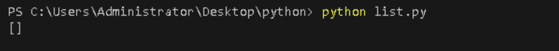

This removes all elements from the list `L`.  

#### **copy()**

Returns a copy of the list.

```python
L = ['yellow', 'red', 'blue', 'green', 'black']
L_copy = L.copy()
print(L_copy)
```
**Output:**

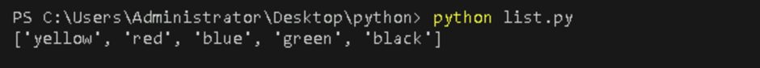

This creates a copy of the list `L` and prints it.  

#### **count()**
Returns the number of elements with the specified value.

```python
L = ['yellow', 'red', 'blue', 'green', 'black']
count_red = L.count('red')
print(count_red)
```
**Output:**

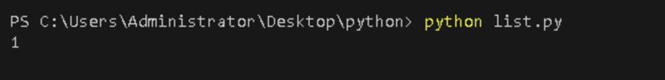

This counts how many times `'red'` appears in the list `L`.  

#### **extend()**

Adds the elements of a list (or any iterable) to the end of the current list.

```python
L = ['yellow', 'red', 'blue', 'green', 'black']
L.extend(['orange', 'purple'])
print(L)
```
**Output:**

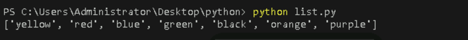

This adds `['orange', 'purple']` to the end of the list `L`.  


#### **index()**

Returns the index of the first element with the specified value. If the value is not present, it raises a ValueError.

```python
L = ['yellow', 'red', 'blue', 'green', 'black']
index_of_blue = L.index('blue')
print(index_of_blue)
```
**Output:**

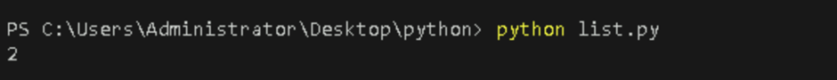

This returns the index of `'blue'` in the list `L`.  

#### **insert()**

Adds an element at the specified position.

```python
L = ['yellow', 'red', 'blue', 'green', 'black']
L.insert(0, "white")
print(L)
```
**Output:**

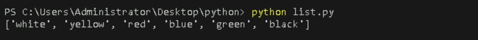

This inserts `"white"` at the beginning of the list `L`.  

#### **pop()**

Removes the element at the specified position and returns it. If no index is specified, it removes and returns the last item in the list.

```python
L = ['yellow', 'red', 'blue', 'green', 'black']
removed_item = L.pop(1)
print(removed_item)  
print(L)
```
**Output:**

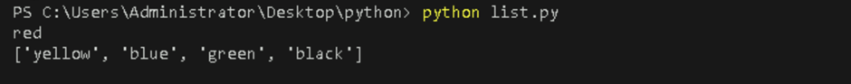

This removes the element at index `1` in the list `L`.  

#### **remove()**

Removes the item with the specified value. If the value is not found, it raises a ValueError.

```python
L = ['yellow', 'red', 'blue', 'green', 'black']
L.remove("green")
print(L)
```
**Output:**

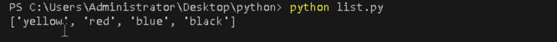

This removes `"white"` from the list `L`.  

#### **reverse()**

Reverses the order of the list.
 
```python
L = ['yellow', 'red', 'blue', 'green', 'black']
L.reverse()
print(L)
```
**Output:**

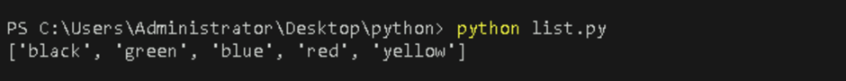

This reverses the order of the elements in the list `L`.  

#### **sort()**
 
Sorts the list in ascending order.
 
```python
L = ['yellow', 'red', 'blue', 'green', 'black']
L.sort()
print(L)
```
**Output:**

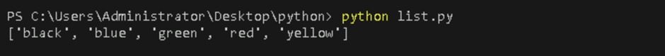

This sorts the elements of the list `L` in ascending order.  

---

    
## **2. Tuples**
--------------

A tuple is an immutable (non-modifiable) collection of items in Python. Tuples can hold items of different data types and are defined using parentheses `()`.

   - [**Creation**](#creation-1)
   - [**Accessing / Indexing**](#accessing--indexing-1)
   - [**Negative Indexing**](#negative-indexing)
   - [**Slicing**](#slicing)
   - [**Length**](#length)
   - [**Tuple Methods**](#tuple-methods)
      - [**count()**](#count)
      - [**index()**](#index)
   - [**Immutability of Tuples**](#immutability-of-tuples)
      - [**Concatenation**](#concatenation)

### **Creation**

Creating a tuple initializes it with specified elements.

```python
T = ('apple', 'banana', 'cherry')
print(T)
```
**Output:**

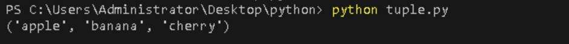

This code creates a tuple of fruits named `T` and prints it.


### **Accessing / Indexing**

Accessing an element in a tuple refers to retrieving a specific item using its index.

```python
T = ('apple', 'banana', 'cherry')
print(T[1])

```
**Output:**

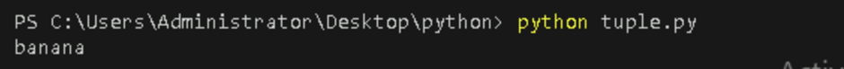

This accesses the second element of the tuple `T`.  

### **Negative Indexing**

Negative indexing allows you to access elements from the end of the tuple. The index `-1` refers to the last item, `-2` to the second last, and so on.

```python
T = ('apple', 'banana', 'cherry')
print(T[-1])
```
**Output:**

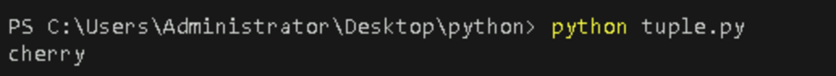

This accesses the last element of the tuple `T`.  


### **Slicing**

Slicing allows you to obtain a subset of elements from the tuple by specifying a range of indices.

```python
T = ('apple', 'banana', 'cherry')
print(T[0:2])  
```
**Output:**

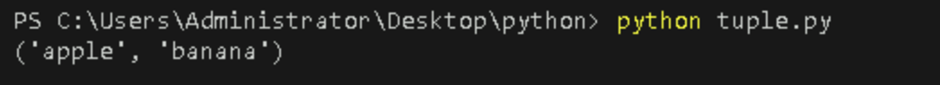

This retrieves a subset of the tuple `T` from index 0 to 1.  

You can also use **negative indexing** in slicing.

```python
print(T[-2:])  
```
**Output:**

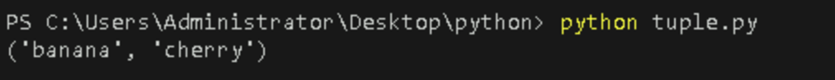

This retrieves the last two elements of the tuple `T` using negative indexing.  


### **Length**

The length function returns the total number of items present in the tuple.

```python
T = ('apple', 'banana', 'cherry')
print(len(T))
```
**Output:**

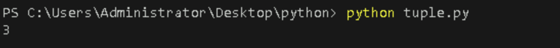

This returns the total number of items in the tuple `T`.  


### **Tuple Methods**

Here are some methods for working with tuples:

#### **count()**

Returns the number of times a specified value appears in the tuple.

```python
T = ('apple', 'banana', 'cherry')
count_apple = T.count('apple')
print(count_apple)
```
**Output:**


This counts how many times `'apple'` appears in the tuple `T`.  


#### **index()**

Returns the index of the first occurrence of a specified value. If the value is not found, it raises a `ValueError`.

```python
T = ('apple', 'banana', 'cherry')
index_banana = T.index('banana')
print(index_banana)
```
**Output:**

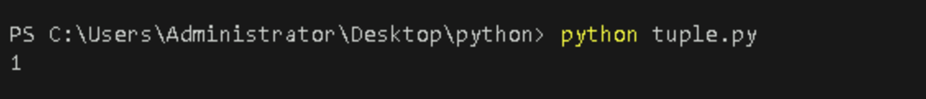

This returns the index of `'banana'` in the tuple `T`.  


### **Immutability of Tuples**

Since tuples are immutable, they **cannot be modified** once created. The methods like `append()`, `remove()`, and `sort()` that exist for lists are **not available** for tuples. To perform operations that involve changes, you must create a new tuple.

#### Concatenation

Concatenation combines two or more tuples into a new tuple.  


```python
T = ('apple', 'banana', 'cherry')
T_new = T + ('orange',)
print(T_new)
```
**Output:**

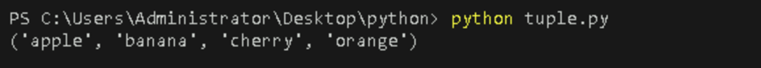

This creates a new tuple `T_new` by adding an element (`'orange'`) to the existing tuple `T`.  


## **3. Dictionaries**

A dictionary is a mutable (modifiable) collection of key-value pairs in Python. Dictionaries allow fast lookup and retrieval of values based on their associated keys. They are defined using curly braces `{}` with key-value pairs separated by colons.

  - [**Creation**](#creation)
  - [**Accessing / Indexing**](#accessing--indexing)
  - [**Modifying Values**](#modifying-values)
  - [**Adding New Key-Value Pairs**](#adding-new-key-value-pairs)
  - [**Dictionary Methods**](#dictionary-methods)
    - [**get()**](#get)
    - [**keys()**](#keys)
    - [**values()**](#values)
    - [**items()**](#items)
    - [**copy()**](#copy)
    - [**pop()**](#pop)
    - [**popitem()**](#popitem)
    - [**update()**](#update)
    - [**clear()**](#clear)
  - [**Checking for Existence of Keys**](#checking-for-existence-of-keys)
  - [**Dictionary Comprehensions**](#dictionary-comprehensions)

### **Creation**

Creating a dictionary initializes it with specified key-value pairs.

```python
D = {'name': 'John', 'age': 25, 'city': 'New York'}
print(D)
```
**Output:**

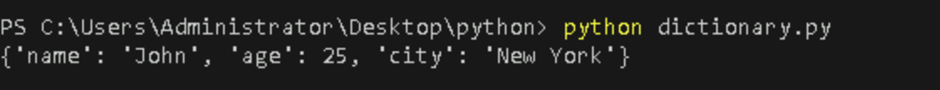

This code creates a dictionary `D` with keys like `'name'`, `'age'`, and `'city'`, and prints it.


### **Accessing / Indexing**

Accessing a value in a dictionary refers to retrieving the value associated with a specific key.

```python
D = {'name': 'John', 'age': 25, 'city': 'New York'}
print(D['name'])
```
**Output:**

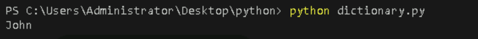

This retrieves the value associated with the key `'name'` in dictionary `D`.  


### **Modifying Values**

You can modify values in a dictionary by assigning a new value to an existing key.

```python
D = {'name': 'John', 'age': 25, 'city': 'New York'}
D['age'] = 30
print(D)
```

**Output:**

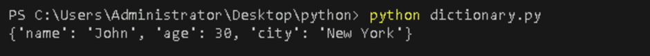

This changes the value of the `'age'` key to `30` in dictionary `D`.


### **Adding New Key-Value Pairs**

To add a new key-value pair, you simply assign a value to a new key.

```python
D = {'name': 'John', 'age': 25, 'city': 'New York'}
D['job'] = 'Engineer'
print(D)
```
**Output:**

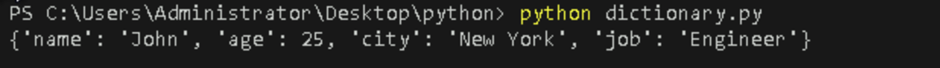

This adds a new key `'job'` with the value `'Engineer'` to dictionary `D`.  


### **Dictionary Methods**


#### get()

Returns the value of the specified key. If the key does not exist, it returns `None` (or a specified default value).

```python
D = {'name': 'John', 'age': 30, 'city': 'New York', 'job': 'Engineer'}
job = D.get('job')
print(job)
```

**Output:**

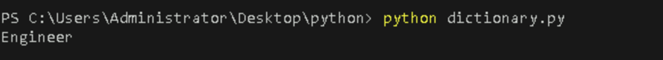

This retrieves the value of the key `'job'` in dictionary `D`.  


#### keys()

Returns a view object containing the dictionary's keys.

```python
D = {'name': 'John', 'age': 30, 'city': 'New York', 'job': 'Engineer'}
keys = D.keys()
print(keys)
```

**Output:**

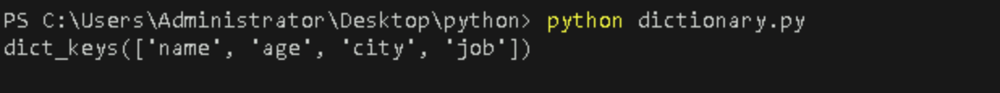

This returns all the keys in the dictionary `D`.  


#### values()

Returns a view object containing the dictionary's values.

```python
D = {'name': 'John', 'age': 30, 'city': 'New York', 'job': 'Engineer'}
values = D.values()
print(values)
```
**Output:**

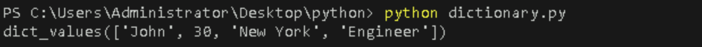

This returns all the values in the dictionary `D`.  


#### items()

Returns a view object containing the dictionary's key-value pairs as tuples.

```python
D = {'name': 'John', 'age': 30, 'city': 'New York', 'job': 'Engineer'}
items = D.items()
print(items)
```

**Output:**

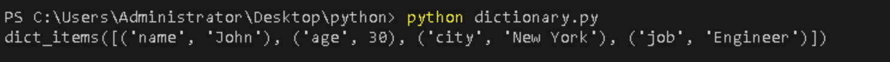

This returns all key-value pairs in dictionary `D`.  


#### copy()

Returns a copy of the dictionary.

```python
D = {'name': 'John', 'age': 30, 'city': 'New York', 'job': 'Engineer'}
D_copy = D.copy()
print(D_copy)
```
**Output:**

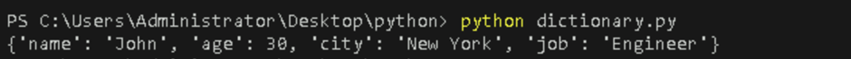

This creates and returns a copy of the dictionary `D`.


#### pop()

Removes the element with the specified key and returns its value. If the key does not exist, it raises a `KeyError`.

```python
D = {'name': 'John', 'age': 30, 'city': 'New York', 'job': 'Engineer'}
job = D.pop('job')
print(job)
print(D)
```
**Output:**

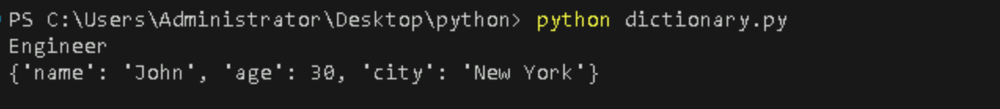

This removes the key `'job'` from dictionary `D` and returns its value.  


#### popitem()

Removes and returns the last inserted key-value pair as a tuple.

```python
D = {'name': 'John', 'age': 30, 'city': 'New York'}
item = D.popitem()
print(item)
print(D)
```
**Output:**

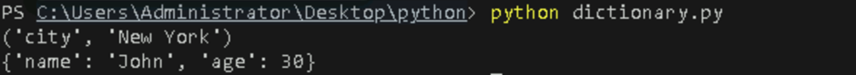

This removes the last key-value pair from the dictionary `D`.  


#### update()

Updates the dictionary with key-value pairs from another dictionary or from a sequence of key-value pairs.

```python
D = {'name': 'John', 'age': 30, 'city': 'New York'}
D.update({'age': 35, 'city': 'Boston'})
print(D)
```
**Output:**

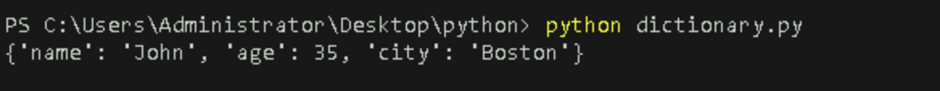

This updates the existing dictionary `D` with new values for the keys `'age'` and `'city'`.  


#### clear()

Removes all the elements from the dictionary.

```python
D = {'name': 'John', 'age': 35, 'city': 'Boston'}
D.clear()
print(D)
```
**Output:**

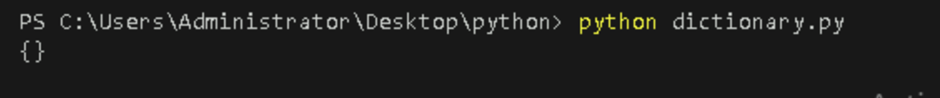

This removes all key-value pairs from dictionary `D`.  


#### Checking for Existence of Keys

You can check if a key exists in a dictionary using the `in` keyword.

```python
D = {'age': 35, 'city': 'Boston'}
if 'name' in D:
    print("Key exists")
else:
    print("Key does not exist")
```
**Output:**

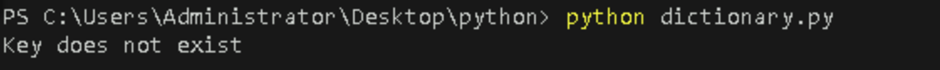

This checks if the key `'name'` exists in dictionary `D`.


### **Dictionary Comprehensions**

You can create a dictionary using comprehensions, which allows you to construct key-value pairs dynamically.

```python
squares = {x: x**2 for x in range(5)}
print(squares)
```
**Output:**

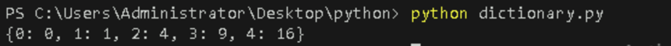

This creates a dictionary where the keys are numbers and the values are their squares.  

---


## **References**

- [Python Lists Documentation](https://docs.python.org/3/tutorial/datastructures.html#more-on-lists)
- [Python Tuples Documentation](https://docs.python.org/3/tutorial/datastructures.html#tuples-and-sequences)
- [Python Dictionaries Documentation](https://docs.python.org/3/tutorial/datastructures.html#dictionaries)

---