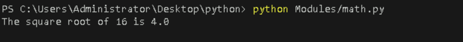
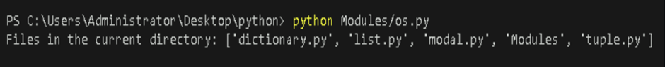
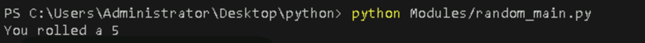
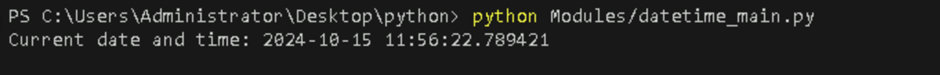
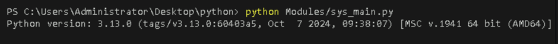
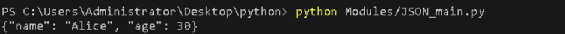
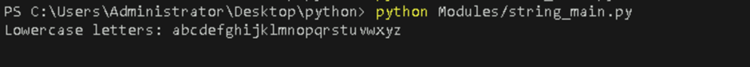
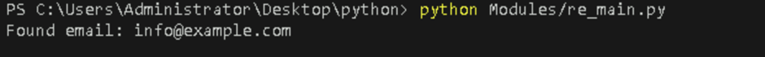
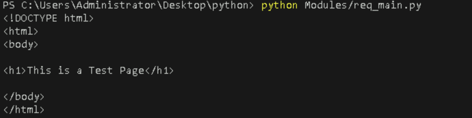
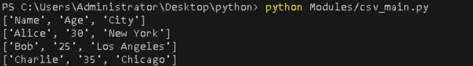

# **Write Functions and Use Python’s Built-In Modules (e.g., `math`, `os`, `random`, `datetime`, `sys`)**

## **Table of Contents**

- [**Introduction**](#Introduction)  
- [**Problem Statement**](#problem-statement) 
- [**Prerequisites**](#Prerequisites)
  - [**Software Requirement**](#software-requirement)  
  - [**Hardware Requirement**](#hardware-requirement)  
- [**Implementation Steps**](#implementation-steps)
  - [**Math Module**](#1-math-module)
  - [**OS Module**](#2-os-module)
  - [**Random Module**](#3-random-module)
  - [**Datetime Module**](#4-datetime-module)
  - [**Sys Module**](#5-sys-module)
  - [**JSON Module**](#6-json-module)
  - [**String Module**](#7-string-module)
  - [**Re Module**](#8-re-module)
  - [**Requests Module**](#9-requests-module)
  - [**CSV Module**](#10-csv-module)    
- [**References**](#references)  
   
---

## **Introduction**

This guide explains how to create Python functions and use built-in modules like `math`, `os`, `random`, `datetime`, `sys`, etc.. to write efficient Python programs.

---

## **Problem Statement**

Learn to create Python functions and use various built-in modules for tasks such as mathematical operations, file management, random number generation, date handling, and system-specific parameter access.

## **Prerequisites**

### **Software Requirement**

- **Python 3.13.0**  
   [Download Python](https://www.python.org/downloads/)

- **Code Editor**  
   A text editor or IDE like **Visual Studio Code (VS Code)** is recommended.  
   [Download VS Code](https://code.visualstudio.com/Download)
   
- **Command Line/Terminal**: For running Python scripts.

### **Hardware Requirement**

- **Processor**: Minimum dual-core processor.
- **RAM**: 4GB or more.
- **Storage**: At least 1GB free space for Python.

---

## **Implementation Steps**


### **Write Python Functions and Use Built-In Modules**


### **Math Module**

The `math` module offers mathematical functions such as trigonometric functions, logarithmic functions, and constants like `pi` and `e`. This module is used to perform complex calculations in Python.


- **Create a new file** 

   - Create a Python file named `math.py` inside your `Modules` folder.

   - Add the following code to `math.py` to demonstrate the use of the `math` module

```python
import math

def calculate_square_root(number):
    """Calculate the square root of a number using the math module."""
    return math.sqrt(number)

result = calculate_square_root(16)
print(f"The square root of 16 is {result}")
```

- **Run the Python file**  

   Use the command below in your terminal to run the Python file:

```bash
python Modules/math.py
``` 

Alternatively you can use:

```bash
cd Modules
python math.py
``` 

**Output:**



The function calculates the square root of the provided number using `math.sqrt()`.


### **OS Module**

The `os` module in Python is used to interact with the operating system. It provides functionality like reading the directory, fetching file paths, and interacting with the file system.

- **Create a new file** 

  - Create a Python file named `os.py` inside your `Modules` folder.

  - Add the following code to `os.py` to demonstrate the use of the `os` module

```python
import os

def list_directory_files(path):
    """List all files in the given directory."""
    return os.listdir(path)

directory_files = list_directory_files(os.getcwd())
print(f"Files in the current directory: {directory_files}")
```

- **Run the Python file**  

   Use the command below in your terminal to run the Python file:

```bash
python Modules/os.py
```

**Output:**



The function lists all files in the provided directory path using `os.listdir()`. Uses `os.getcwd()` to get the current directory path.

### **Random Module**

The `random` module in Python is used to generate random numbers and provides the functionality of various random operations.

- **Create a new file** 

  - Create a Python file named `random_main.py` inside your `Modules` folder.

  - Add the following code to `random_main.py` to demonstrate the use of the `random` module

```python
import random

def roll_dice():
    """Simulate rolling a 6-sided dice using the random module."""
    return random.randint(1, 6)

dice_roll = roll_dice()
print(f"You rolled a {dice_roll}")
```

- **Run the Python file**  

   Use the command below in your terminal to run the Python file:

```bash
python Modules/random_main.py
```

**Output:**



Generates a random integer between 1 and 6 using `random.randint()` to simulate rolling a dice.

### **Datetime Module**

The `datetime` module allows for manipulation and reading of date and time values.

- **Create a new file** 

  - Create a Python file named `datetime_main.py` inside your `Modules` folder.

  - Add the following code to `datetime_main.py` to demonstrate the use of the `datetime` module

```python
import datetime

def get_current_datetime():
    """Get the current date and time using the datetime module."""
    return datetime.datetime.now()

current_time = get_current_datetime()
print(f"Current date and time: {current_time}")
```

- **Run the Python file**  

   Use the command below in your terminal to run the Python file:

```bash
python Modules/datetime_main.py
```

**Output:**



Retrieves the current date and time using `datetime.datetime.now()`.


### **Sys Module**

The `sys` module in Python provides functions and variables that interact with the Python runtime environment.

- **Create a new file** 

  - Create a Python file named `sys_main.py` inside your `Modules` folder.

  - Add the following code to `sys_main.py` to demonstrate the use of the `sys` module

```python
import sys

def get_python_version():
    """Get the version of Python being used."""
    return sys.version

python_version = get_python_version()
print(f"Python version: {python_version}")
```

- **Run the Python file**  

   Use the command below in your terminal to run the Python file:

```bash
python Modules/sys_main.py
```

**Output:**



Retrieves the current Python version using `sys.version`.


### **JSON Module**

The `json` module provides methods for parsing JSON data and converting Python objects to JSON format.

- **Create a new file** 

  - Create a Python file named `JSON_main.py` inside your `Modules` folder.

  - Add the following code to `JSON_main.py` to demonstrate the use of the `JSON` module

```python
import json

def convert_dict_to_json(data):
    """Convert a Python dictionary to a JSON string."""
    return json.dumps(data)

data = {"name": "Alice", "age": 30}
json_data = convert_dict_to_json(data)
print(json_data) 
```

- **Run the Python file**  

   Use the command below in your terminal to run the Python file:

```bash
python Modules/JSON_main.py
```

**Output:**



Converts a Python dictionary to a JSON string using `json.dumps()`.


### **String Module**

The `string` module provides common string operations and constants.

- **Create a new file** 

  - Create a Python file named `string_main.py` inside your `Modules` folder.

  - Add the following code to `string_main.py` to demonstrate the use of the `string` module

```python
import string

def get_alphabet():
    """Return all lowercase letters."""
    return string.ascii_lowercase

alphabet = get_alphabet()
print(f"Lowercase letters: {alphabet}")
```

- **Run the Python file**  

   Use the command below in your terminal to run the Python file:

```bash
python Modules/string_main.py
```

**Output:**



Returns all lowercase letters using `string.ascii_lowercase`.

### **Re Module**

The `re` module provides support for regular expressions.

- **Create a new file** 

  - Create a Python file named `re_main.py` inside your `Modules` folder.

  - Add the following code to `re_main.py` to demonstrate the use of the `re` module

```python
import re

def find_email(text):
    """Find the first email address in a given text."""
    pattern = r"[a-zA-Z0-9._%+-]+@[a-zA-Z0-9.-]+\.[a-zA-Z]{2,4}"
    match = re.search(pattern, text)
    return match.group() if match else None

email = find_email("Contact us at info@example.com.")
print(f"Found email: {email}")  
```

- **Run the Python file**  

   Use the command below in your terminal to run the Python file:

```bash
python Modules/re_main.py
```

**Output:**



Finds the first email address in the given text using a regular expression pattern.


### **Requests Module**

The `requests` module is used for making HTTP requests (this requires installing the requests library).

- **Create a new file** 

  - Create a Python file named `req_main.py` inside your `Modules` folder.

  - Add the following code to `req_main.py` to demonstrate the use of the `requests` module


```python
import requests

def fetch_webpage_content(url):
    """Fetch and return the content of a webpage."""
    response = requests.get(url)
    return response.text

content = fetch_webpage_content('https://w3schools.com/python/demopage.htm')
print(content)

```

- **Run the Python file**  

   Use the command below in your terminal to run the Python file:

```bash
python Modules/req_main.py
```

**Output:**



Fetches and prints the HTML content of a given webpage.


### **CSV Module**

The `csv` module is used for reading and writing CSV (Comma Separated Values) files.

- **Create a new file** 

  - Create a Python file named `csv_main.py` inside your `Modules` folder.

  - Add the following code to `csv_main.py` to demonstrate the use of the `csv` module

```python
import csv

def create_sample_csv(file_name):
    """Create a sample CSV file for testing."""
    with open(file_name, mode='w', newline='') as file:
        writer = csv.writer(file)
        writer.writerow(["Name", "Age", "City"])
        writer.writerow(["Alice", 30, "New York"])
        writer.writerow(["Bob", 25, "Los Angeles"])
        writer.writerow(["Charlie", 35, "Chicago"])


def read_csv(file_name):
    """Read and print contents of a CSV file."""
    with open(file_name, mode='r') as file:
        csv_reader = csv.reader(file)
        for row in csv_reader:
            print(row)

create_sample_csv('sample.csv')

read_csv('sample.csv')
```

- **Run the Python file**  

   Use the command below in your terminal to run the Python file:

```bash
python Modules/csv_main.py
```

**Output:**



Creates a sample CSV file and then reads and prints its content row by row.

---

## **References**

- [Python built in modules](https://docs.python.org/3/library/index.html)
- [Built in modules](https://www.geeksforgeeks.org/built-in-modules-in-python/)

---