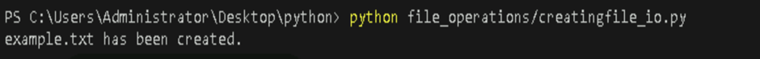
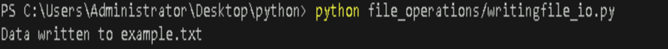
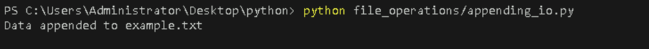
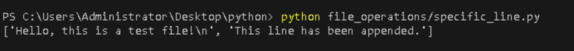
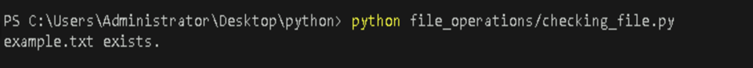
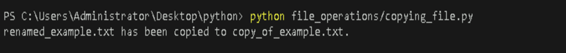
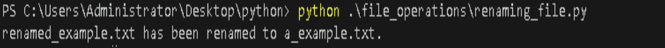
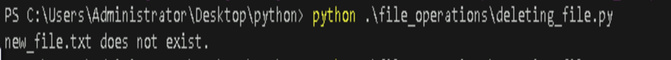
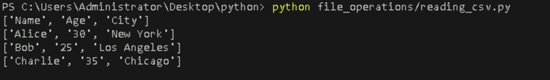
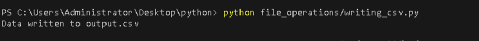

# **Handle File I/O Operations like Reading from and Writing to Files**

## **Table of Contents**

- [**Introduction**](#introduction)  
- [**Problem Statement**](#problem-statement) 
- [**Prerequisites**](#prerequisites)
  - [**Software Requirement**](#software-requirement)  
  - [**Hardware Requirement**](#hardware-requirement)  
- [**Implementation Steps**](#implementation-steps)   
  - [**Creating a New File**](#creating-a-new-file)
  - [**Writing to a File**](#writing-to-a-file)
  - [**Reading from a File**](#reading-from-a-file)
  - [**Appending to a File**](#appending-to-a-file)
  - [**Reading Specific Lines from a File**](#reading-specific-lines-from-a-file)
  - [**Checking if a File Exists**](#checking-if-a-file-exists)
  - [**Copying a File**](#copying-a-file)
  - [**Renaming a File**](#renaming-a-file)
  - [**Deleting a File**](#deleting-a-file)
  - [**Reading CSV Files**](#reading-csv-files)
  - [**Writing CSV Files**](#writing-csv-files)
- [**References**](#references)  
   
---

## **Introduction**

This guide explains how to handle file I/O operations in Python, including reading from and writing to files. Understanding file handling is crucial for data persistence and manipulation in any application.

---

## **Problem Statement**

Learn to create Python functions to read from and write to files. This knowledge is essential for handling data storage, configuration files, logs, and more in real-world applications.

## **Prerequisites**

###  **Software Requirement**

- **Python 3.13.0**  
   [Download Python](https://www.python.org/downloads/)

- **Code Editor**  
   A text editor or IDE like **Visual Studio Code (VS Code)** is recommended.  
   [Download VS Code](https://code.visualstudio.com/Download)
   
- **Command Line/Terminal**: For running Python scripts.

### **Hardware Requirement**

- **Processor**: Minimum dual-core processor.
- **RAM**: 4GB or more.
- **Storage**: At least 1GB free space for Python.

---

## **Implementation Steps**

### **Write Functions for File I/O Operations**

#### **Creating a New File**

To create a new file, use the `'w'` mode with the `open()` function.

- **Create a new file** 

  - Create a Python file named `creatingfile_io.py` inside your `file_operations` folder and add the following code.


```python
def create_file(filename):
    """Create a new file."""
    with open(filename, 'w') as file:
        file.write('This is a new file.')
    print(f"{filename} has been created.")

# Create a new file
create_file('example.txt')
```
- **Run the Python file**  

   Use the command below in your terminal to run the Python file:

```bash
python file_operations/creatingfile_io.py
```

Alternatively, you can use:
```bash
cd file_operations
python creatingfile_io.py
```

**Output:**



This function creates a new file and writes a line of text to it.


#### **Writing to a File**

- **Create a new file** 

  - Create a Python file named `writingfile_io.py` inside your `file_operations` folder and add the following code.

```python
def write_to_file(filename, data):
    """Write data to a file."""
    with open(filename, 'w') as file:
        file.write(data)
        print(f'Data written to {filename}')

write_to_file('example.txt', 'Hello, this is a test file!')
```

- **Run the Python file**  

   Use the command below in your terminal to run the Python file:

```bash
python file_operations/writingfile_io.py
```

**Output:**



This function writes the specified data to the given file.


#### **Reading from a File**

- **Create a new file** 

  - Create a Python file named `readingfile_io.py` inside your `file_operations` folder and add the following code.

```python
def read_from_file(filename):
    """Read data from a file."""
    with open(filename, 'r') as file:
        return file.read()

data = read_from_file('example.txt')
print(data)
```

- **Run the Python file**  

   Use the command below in your terminal to run the Python file:

```bash
python file_operations/readingfile_io.py
```

**Output:**


This function reads the entire content of the specified file.*


#### **Appending to a File**

- **Create a new file** 

  - Create a Python file named `appending_io.py` inside your `file_operations` folder and add the following code.

```python
def append_to_file(filename, data):
    """Append data to a file."""
    with open(filename, 'a') as file:
        file.write(data)
        print(f"Data appended to {filename}")

append_to_file('example.txt', '\nThis line has been appended.')
```

- **Run the Python file**  

   Use the command below in your terminal to run the Python file:

```bash
python file_operations/appending_io.py
```

**Output:**



This function appends data to the end of the specified file.


#### **Reading a File Line by Line**

- **Create a new file** 

  - Create a Python file named `read_line.py` inside your `file_operations` folder and add the following code.

```python
def read_file_line_by_line(filename):
    """Read a file line by line."""
    with open(filename, 'r') as file:
        for line in file:
            print(line.strip())

read_file_line_by_line('example.txt')
```

- **Run the Python file**  

   Use the command below in your terminal to run the Python file:

```bash
python file_operations/read_line.py
```

**Output:**


This function reads and prints each line of the specified file.


#### **Reading Specific Lines from a File**

- **Create a new file** 

  - Create a Python file named `specific_line.py` inside your `file_operations` folder and add the following code.

```python
def read_specific_lines(filename, start_line, end_line):
    """Read specific lines from a file."""
    with open(filename, 'r') as file:
        lines = file.readlines()
        return lines[start_line:end_line]

specific_lines = read_specific_lines('example.txt', 0, 2)
print(specific_lines)
```

- **Run the Python file**  

   Use the command below in your terminal to run the Python file:

```bash
python file_operations/specific_line.py
```

**Output:**



This function reads and returns specific lines from the file based on the given line numbers.


#### **Checking if a File Exists**

- **Create a new file** 

  - Create a Python file named `checking_file.py` inside your `file_operations` folder and add the following code.

```python
import os

def check_file_exists(filename):
    """Check if a file exists."""
    if os.path.isfile(filename):
        print(f"{filename} exists.")
    else:
        print(f"{filename} does not exist.")

check_file_exists('example.txt')
```

- **Run the Python file**  

   Use the command below in your terminal to run the Python file:

```bash
python file_operations/checking_file.py
```

**Output:**



This function checks if the specified file exists.


#### **Copying a File**

- **Create a new file** 

  - Create a Python file named `copying_file.py` inside your `file_operations` folder and add the following code.

```python
import shutil

def copy_file(source, destination):
    """Copy a file from source to destination."""
    shutil.copy(source, destination)
    print(f"{source} has been copied to {destination}.")

copy_file('renamed_example.txt', 'copy_of_example.txt')
```

- **Run the Python file**  

   Use the command below in your terminal to run the Python file:

```bash
python file_operations/copying_file.py
```

**Output:**



This function copies a file from one location to another.


#### **Renaming a File**

- **Create a new file** 

  - Create a Python file named `renaming_file.py` inside your `file_operations` folder and add the following code.

```python
import os

def rename_file(old_name, new_name):
    """Rename a file."""
    os.rename(old_name, new_name)
    print(f"{old_name} has been renamed to {new_name}.")

rename_file('renamed_example.txt', 'a_example.txt')
```

- **Run the Python file**  

   Use the command below in your terminal to run the Python file:

```bash
python file_operations/renaming_file.py
```

**Output:**



This function renames the specified file.


#### **Deleting a File**

- **Create a new file** 

  - Create a Python file named `deleting_file.py` inside your `file_operations` folder and add the following code.

```python
def delete_file(filename):
    """Delete a file if it exists."""
    if os.path.isfile(filename):
        os.remove(filename)
        print(f"{filename} has been deleted.")
    else:
        print(f"{filename} does not exist.")

delete_file('new_file.txt')
```

- **Run the Python file**  

   Use the command below in your terminal to run the Python file:

```bash
python file_operations/deleting_file.py
```

**Output:**



This function deletes the specified file if it exists.


#### **Reading CSV Files**

- **Create a new file** 

  - Create a Python file named `reading_csv.py` inside your `file_operations` folder and add the following code.

```python
import csv

def read_csv_file(filename):
    """Read a CSV file."""
    with open(filename, 'r') as csvfile:
        reader = csv.reader(csvfile)
        for row in reader:
            print(row)

read_csv_file('sample.csv')
```

- **Run the Python file**  

   Use the command below in your terminal to run the Python file:

```bash
python file_operations/reading_csv.py
```

**Output:**



This function reads data from a CSV file.


#### **Writing CSV Files**

- **Create a new file** 

  - Create a Python file named `writing_csv.py` inside your `file_operations` folder and add the following code.

```python
import csv

def write_csv_file(filename, data):
    """Write data to a CSV file."""
    with open(filename, 'w', newline='') as csvfile:
        writer = csv.writer(csvfile)
        writer.writerows(data)
        print(f'Data written to {filename}')

data_to_write = [['Name', 'Age'], ['Alice', 30], ['Bob', 25]]
write_csv_file('output.csv', data_to_write)
```

- **Run the Python file**  

   Use the command below in your terminal to run the Python file:

```bash
python file_operations/writing_csv.py
```

**Output:**



This function writes data to a CSV file.

---

## **References**

- [Python Official Documentation](https://docs.python.org/3/)
- [W3Schools - Python File Handling](https://www.w3schools.com/python/python_file_handling.asp)
- [Python File I/O](https://docs.python.org/3/tutorial/inputoutput.html#reading-and-writing-files)
- [Working with Files in Python](https://realpython.com/read-write-files-python/)

---


