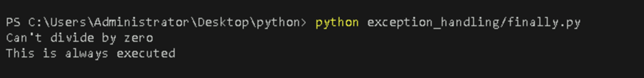

# **Use Python’s Exception Handling to Manage Errors in Your Code**

## **Table of Contents**

- [**Introduction**](#introduction) 
- [**Problem Statement**](#problem-statement) 
- [**Prerequisites**](#prerequisites)
  - [**Software Requirement**](#software-requirement)  
  - [**Hardware Requirement**](#hardware-requirement)  
- [**Implementation Steps**](#implementation-steps)  
  - [**Try Block**](#try-block)
  - [**Except Block**](#except-block)
  - [**Using Else Block**](#using-else-block)
  - [**Finally Block**](#finally-block)
  - [**Raising Exceptions**](#raising-exceptions)
- [**References**](#references)  

---

## **Introduction**

This guide explains how to use Python's exception handling mechanisms to manage errors effectively in your code. Exception handling allows you to gracefully handle runtime errors and maintain program flow without crashing.

---

## **Problem Statement**

Learn how to implement exception handling in Python to manage errors and exceptions. This includes understanding `try`, `except`, `else`, `finally` blocks, and raising exceptions to create robust and error-tolerant applications.

## **Prerequisites**

### **Software Requirement**

- **Python 3.13.0**  
   [Download Python](https://www.python.org/downloads/)

- **Code Editor**  
   A text editor or IDE like **Visual Studio Code (VS Code)** is recommended.  
   [Download VS Code](https://code.visualstudio.com/Download)
   
- **Command Line/Terminal**: For running Python scripts.

### **Hardware Requirement**

- **Processor**: Minimum dual-core processor.
- **RAM**: 4GB or more.
- **Storage**: At least 1GB free space for Python.

---

## **Implementation Steps**

### **Write Code with Exception Handling**


### **Try Block**

The `try` block is used to wrap code that might cause an error during execution. If an error occurs, Python will stop executing the code in this block and jump to the corresponding `except` block.

- **Create a new file** 

  - Create a Python file named `try.py` inside your `exception_handling` folder and add the following code.

```python
def divide_numbers(a, b):
    """Divide two numbers and handle division by zero error."""
    try:
        result = a / b
    except ZeroDivisionError:
        return "Error: Division by zero is not allowed."
    return result

print(divide_numbers(10, 2))  
print(divide_numbers(10, 0)) 
```

- **Run the Python file**  

   Use the command below in your terminal to run the Python file:

```bash
python exception_handling/try.py
```

**Output:**


This function divides two numbers and handles division by zero errors gracefully.

### **Except Block**

The `except` block allows you to define what should happen when an error occurs in the `try` block. You can specify different types of exceptions to handle specific errors.

- **Create a new file** 

  - Create a Python file named `except.py` inside your `exception_handling` folder and add the following code.


```python
def safe_input():
    """Prompt user for input and handle potential value errors."""
    try:
        number = int(input("Enter a number: "))
        print(f"You entered: {number}")
    except ValueError:
        print("Error: Please enter a valid integer.")

safe_input()
```

- **Run the Python file**  

   Use the command below in your terminal to run the Python file:

```bash
python exception_handling/except.py
```

**Output:**


This function prompts the user for input and handles cases where the input is not a valid integer.

### **Using Else Block**

The `else` block is executed if the code in the `try` block runs without any errors. It is optional and can be used to define actions that should only happen if no exceptions were raised.

- **Create a new file** 

  - Create a Python file named `using_else` inside your `exception_handling` folder and add the following code.

```python
def read_file(file_name):
    """Read and return content from a file."""
    try:
        with open(file_name, 'r') as file:
            content = file.read()
    except FileNotFoundError:
        return "Error: File not found."
    else:
        return content

print(read_file("example.txt")) 
print(read_file("non_existing_file.txt"))  
```

- **Run the Python file**  

   Use the command below in your terminal to run the Python file:

```bash
python exception_handling/using_else.py
```

**Output:**


This function attempts to read a file and uses the `else` block to return content only if no errors occur.

### **Finally Block**

The `finally` block allows you to execute code regardless of whether an exception occurred or not.

- **Create a new file** 

  - Create a Python file named `finally.py` inside your `exception_handling` folder and add the following code.

```python
def divide_numbers():
    try:
        k = 5 // 0  
        print(k)

    except ZeroDivisionError:
        print("Can't divide by zero")  

    finally:
        print('This is always executed')  

divide_numbers()

```

- **Run the Python file**  

   Use the command below in your terminal to run the Python file:

```bash
python exception_handling/finally.py
```

**Output:**



 This function demonstrates exception handling by trying to divide by zero, catching the resulting `ZeroDivisionError`, and executing code in the `finally` block that runs regardless of an exception.


### **Raising Exceptions**

You can raise exceptions using the `raise` statement.

- **Create a new file** 

  - Create a Python file named `raising_exception.py` inside your `exception_handling` folder and add the following code.

```python
def validate_age(age):
    """Check if the age is valid."""
    if age < 0:
        raise ValueError("Age cannot be negative.")
    return age

try:
    validate_age(-5)
except ValueError as e:
    print(e)
```

- **Run the Python file**  

   Use the command below in your terminal to run the Python file:

```bash
python exception_handling/raising_exception.py
```

**Output:**


 The function checks if the age is negative and raises a `ValueError`(Age cannot be negative), which is caught in the `except` block.

---

## **References**

- [Python Exceptions Documentation](https://docs.python.org/3/tutorial/errors.html)
- [Python Exception Handling](https://realpython.com/python-exceptions/)
- [W3Schools - Python File Handling](https://www.w3schools.com/python/gloss_python_error_handling.asp)
---
