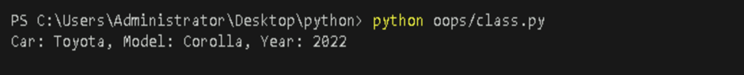
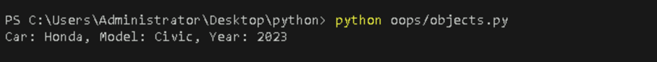
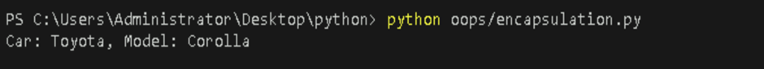
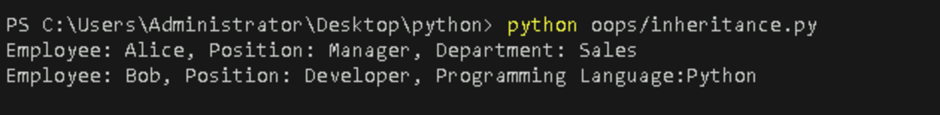
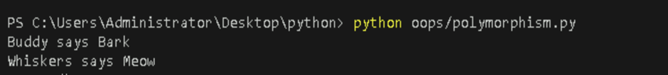
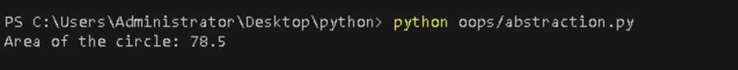

# **Implement Object-Oriented Programming Concepts in Python**

## **Table of Contents**

- [**Introduction**](#Introduction) 
- [**Problem Statement**](#problem-statement) 
- [**Prerequisites**](#Prerequisites)  
  - [**Software Requirement**](#software-requirement) 
  - [**Hardware Requirement**](#hardware-requirement) 
- [**Implementation Steps**](#implementation-steps)
  - [**Define Classes and Objects**](#define-classes-and-objects)
    - [**Class**](#class)
    - [**Objects**](#objects)
  - [**Implement OOP Concepts**](#implement-oop-concepts)
    - [**Encapsulation**](#1-encapsulation)
    - [**Inheritance**](#2-inheritance)
    - [**Polymorphism**](#3-polymorphism)
    - [**Abstraction**](#4-abstraction)  
- [**References**](#references)

---

## **Introduction**

This section explains how to implement the core principles of Object-Oriented Programming (OOP) in Python, such as encapsulation, inheritance, polymorphism, and abstraction. OOP helps in building reusable and modular code by defining objects and classes.

---

## **Problem Statement**

Understand how to implement object-oriented programming in Python, including creating classes, defining methods, and using OOP principles to organize code.

---

## **Prerequisites**

### **Software Requirement**

- **Python 3.13.0**  
   [Download Python](https://www.python.org/downloads/)

- **Code Editor**  
   A text editor or IDE like **Visual Studio Code (VS Code)** is recommended.  
   [Download VS Code](https://code.visualstudio.com/Download)
   
- **Command Line/Terminal**: For running Python scripts.

### **Hardware Requirement**

- **Processor**: Minimum dual-core processor.
- **RAM**: 4GB or more.
- **Storage**: At least 1GB free space for Python.

---

## **Implementation Steps**

### **Define Classes and Objects**

#### **Class**

A **class** in Python is a blueprint for creating objects. It defines properties (attributes) and behaviors (methods) that the objects created from the class will have.

- **Create a new file** 

  - Create a Python file named `class.py` inside your `oops` folder and add the following code.


```python
class Car:
    def __init__(self, make, model, year):
        self.make = make
        self.model = model
        self.year = year
    
    def display_info(self):
        print(f"Car: {self.make}, Model: {self.model}, Year: {self.year}")

my_car = Car("Toyota", "Corolla", 2022)
my_car.display_info()
```

- **Run the Python file**  

   Use the command below in your terminal to run the Python file:

```bash
python oops/class.py
```
   Alternatively, you can use:

```bash
cd oops
python class.py
```  

**Output**:



`Car` is a class that represents a blueprint for creating car objects with attributes `make`, `model`, and `year`.


#### **Objects**

An **object** is an instance of a class. When a class is defined, no memory is allocated until an object of that class is created.


- **Create a new file** 

  - Create a Python file named `objects.py` inside your `oops` folder and add the following code.


```python
class Car:
    def __init__(self, make, model, year):
        self.make = make
        self.model = model
        self.year = year
    
    def display_info(self):
        print(f"Car: {self.make}, Model: {self.model}, Year: {self.year}")

my_car = Car("Toyota", "Corolla", 2022)
my_second_car = Car("Honda", "Civic", 2023)  # Object creation for my_second_car
my_second_car.display_info()
```

- **Run the Python file**  

   Use the command below in your terminal to run the Python file:

```bash
python oops/objects.py
```


**Output**:



`my_second_car` is an object (instance) of the `Car` class with the specified `make`, `model`, and `year`.

---

### **Implement OOP Concepts**

#### **1. Encapsulation**

Encapsulation is the concept of bundling data (variables) and methods (functions) into a single unit or class. You can restrict access to variables and methods using access modifiers like `_` (protected) and `__` (private).

- **Create a new file** 

  - Create a Python file named `encapsulation.py` inside your `oops` folder and add the following code.


```python
class Car:
    """A class to represent a car."""

    def __init__(self, make, model):
        self.make = make  # public attribute
        self._model = model  # protected attribute

    def display_info(self):
        print(f"Car: {self.make}, Model: {self._model}")

# Create an instance of Car
car = Car("Toyota", "Corolla")
car.display_info()  # Accessing public and protected attributes
```

- **Run the Python file**  

   Use the command below in your terminal to run the Python file:

```bash
python oops/encapsulation.py
```

**Output**:



The `Car` class encapsulates the car's make and model, providing controlled access to its attributes.


#### **2. Inheritance**

Inheritance allows one class to inherit the attributes and methods of another class.This promotes code reuse and establishes a parent-child relationship between classes.


- **Create a new file** 

  - Create a Python file named `inheritance.py` inside your `oops` folder and add the following code.


```python
class Employee:
    def __init__(self, name, position):
        self.name = name
        self.position = position
    
    def display_info(self):
        return f"Employee: {self.name}, Position: {self.position}"

class Manager(Employee):
    def __init__(self, name, department):
        super().__init__(name, "Manager")  # Call the parent class constructor
        self.department = department
    
    def display_info(self):
        return f"{super().display_info()}, Department: {self.department}"

class Developer(Employee):
    def __init__(self, name, programming_language):
        super().__init__(name, "Developer")  # Call the parent class constructor
        self.programming_language = programming_language
    
    def display_info(self):
        return f"{super().display_info()}, Programming Language: {self.programming_language}"

# Create instances of Manager and Developer
manager = Manager("Alice", "Sales")
developer = Developer("Bob", "Python")

print(manager.display_info())
print(developer.display_info())
```
- **Run the Python file**  

   Use the command below in your terminal to run the Python file:

```bash
python oops/inheritance.py
```

**Output**:



`Manager` and `Developer` classes inherit from the `Employee` class and provide specific details relevant to their roles while using the base functionality of the `Employee` class.


#### **3. Polymorphism**

Polymorphism allows different classes to have methods with the same name but behave differently based on the object type.

- **Create a new file** 

  - Create a Python file named `polymorphism.py` inside your `oops` folder and add the following code.


```python
class Animal:
    def __init__(self, name):
        self.name = name

class Dog(Animal):
    def make_sound(self, sound="Bark"):
        print(f"{self.name} says {sound}")

class Cat(Animal):
    def make_sound(self, sound="Meow"):
        print(f"{self.name} says {sound}")

# Polymorphism in action
animals = [Dog("Buddy"), Cat("Whiskers")]

for animal in animals:
    animal.make_sound()  # Calls the make_sound method based on the object type
```

- **Run the Python file**  

   Use the command below in your terminal to run the Python file:

```bash
python oops/polymorphism.py
```

**Output**:



The `Dog` and `Cat` classes demonstrate polymorphism by having the same `make_sound` method, but their behavior changes based on the object.

#### **4. Abstraction**

Abstraction hides the internal details and only shows the necessary functionality. This can be achieved using abstract base classes in Python (via the `abc` module).

- **Create a new file** 

  - Create a Python file named `abstraction.py` inside your `oops` folder and add the following code.


```python
from abc import ABC, abstractmethod

class Shape(ABC):
    """Abstract class for shapes."""

    @abstractmethod
    def area(self):
        pass

class Circle(Shape):
    def __init__(self, radius):
        self.radius = radius

    def area(self):
        return 3.14 * self.radius ** 2

circle = Circle(5)
print(f"Area of the circle: {circle.area()}")
```

- **Run the Python file**  

   Use the command below in your terminal to run the Python file:

```bash
python oops/abstraction.py
```

**Output**:



The `Shape` abstract class defines an interface for shapes, and the `Circle` class provides a concrete implementation of the `area` method.

---

## **References**

- [Python Classes Documentation](https://docs.python.org/3/tutorial/classes.html)
- [Object-Oriented Programming in Python](https://realpython.com/python3-object-oriented-programming/)

---