# **Work with External Libraries Using pip and Create Virtual Environments**

## **Table of Contents**

- [**Introduction**](#introduction)
- [**Problem Statement**](#problem-statement)
- [**Prerequisites**](#prerequisites)
  - [**Software Requirement**](#software-requirement)
  - [**Hardware Requirement**](#hardware-requirement)
- [**Implementation Steps**](#implementation-steps)
  - [**Why Do We Need Virtual Environments?**](#why-do-we-need-virtual-environments)
  - [**Creating a Virtual Environment**](#creating-a-virtual-environment)
  - [**Activating the Virtual Environment**](#activate-the-virtual-environment)
  - [**Installing pip**](#installing-pip)
  - [**Installing Libraries Inside the Virtual Environment**](#installing-libraries-inside-the-virtual-environment)
  - [**Program 1: Using `requests` Library**](#program-1-using-requests-library)
  - [**Program 2: Using `matplotlib` Library**](#program-2-using-matplotlib-library)
  - [**Program 3: Using `pandas` Library**](#program-3-using-pandas-library)
- [**References**](#references)

---

## **Introduction**

In Python, external libraries are essential for extending functionality. The `pip` tool allows you to install these libraries efficiently. Virtual environments help isolate projects, ensuring that dependencies are managed separately for each project.

---

## **Problem Statement**

Learn how to install external Python libraries using `pip`, create virtual environments, and manage dependencies for Python projects.

---

## **Prerequisites**

### **Software Requirement**

- **Python 3.13.0**  
   [Download Python](https://www.python.org/downloads/)

- **Code Editor**  
   A text editor or IDE like **Visual Studio Code (VS Code)** is recommended.  
   [Download VS Code](https://code.visualstudio.com/Download)


### **Hardware Requirement**

- **Processor**: Minimum dual-core processor.
- **RAM**: 4GB or more.
- **Storage**: 1GB of free space for Python and external libraries.

---

## **Implementation Steps**

### **Why Do We Need Virtual Environments?**

Virtual environments are essential for Python projects to:

1. **Isolate Project Dependencies**: Each project can have its own versions of libraries, preventing conflicts.
2. **Avoid Global Installation Issues**: Libraries installed globally might interfere with each other. Virtual environments keep them separate.
3. **Reproducibility**: Ensures that a project uses the exact same versions of libraries, making it easier to reproduce results.

Without a virtual environment, you could face version conflicts between projects and difficulty in managing dependencies. For instance, two projects may require different versions of the same library. Virtual environments solve this problem by keeping project-specific dependencies isolated.


### **Creating a Virtual Environment**

**Step 1: Navigate to Your Project Directory**

Open the terminal and navigate to your project folder using `cd` (change directory) commands:

```bash
cd path/to/your/project
```


**Step 2: Create the Virtual Environment**

Once in your project directory, run the following command to create a virtual environment:

```bash
python -m venv venv_name
```

- `venv_name`: The name of your virtual environment (e.g., `myenv`).

For example:

```bash
python -m venv myenv
```


Here is the step-by-step process to do this in VSCode:

1.	Open PowerShell in VSCode:
	- Open your project in VSCode.
	- Open a new terminal in VSCode (View > Terminal or Ctrl+` ).
    - Eurnse the terminal is set to PowerShell.

2.	Check the current execution policy:

```bash
Get-ExecutionPolicy
```

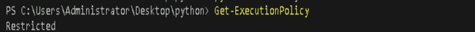


3.	Change the execution policy for the current user:

```bash
Set-ExecutionPolicy RemoteSigned -Scope CurrentUser
```

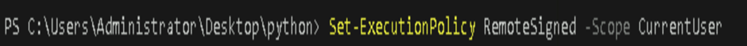

   *OR*

```bash
Set-ExecutionPolicy Unrestricted -Scope CurrentUser
```


**Step 3:Activate the Virtual Environment**

After creating the virtual environment, activate it:

- On **Windows**:

```bash
myenv\Scripts\activate
```


After activation, you'll notice that the command prompt changes to include the virtual environment name, like this:

```bash
(myenv) C:\path\to\your\project>
```

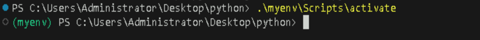

---

### **Installing pip**

`pip` is the package manager for Python, and it comes pre-installed with Python 3.13.0 . You can check if `pip` is installed and up-to-date by running the following command inside your virtual environment:

```bash
python -m ensurepip --upgrade
```

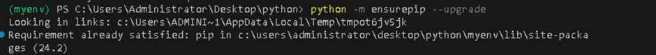

Now you're ready to install external libraries using `pip`!

---

### **Installing Libraries Inside the Virtual Environment**

Once the virtual environment is activated, you can install libraries using `pip`. Let’s install three common Python libraries:

- `requests` – For making HTTP requests.

- `matplotlib` – For plotting and data visualization.

- `pandas` – For data manipulation and analysis.

### **Install the Libraries**

1. **Install `requests`:**

```bash
pip install requests
```

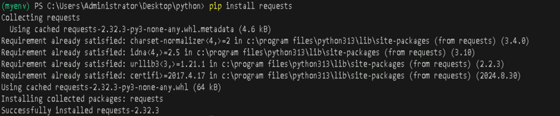

2. **Install `matplotlib`:**

```bash
pip install matplotlib
```

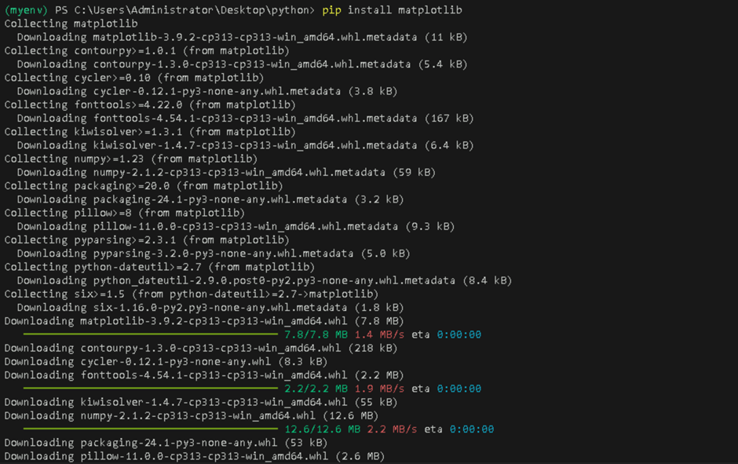

3. **Install `pandas`:**

```bash
pip install pandas
```
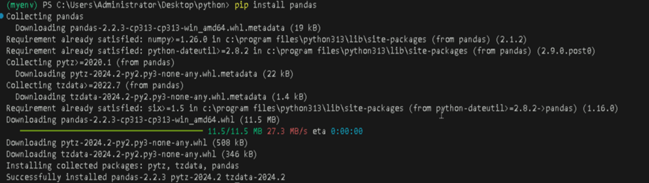


Once installed, you can verify the libraries by listing them:

```bash
pip list
```

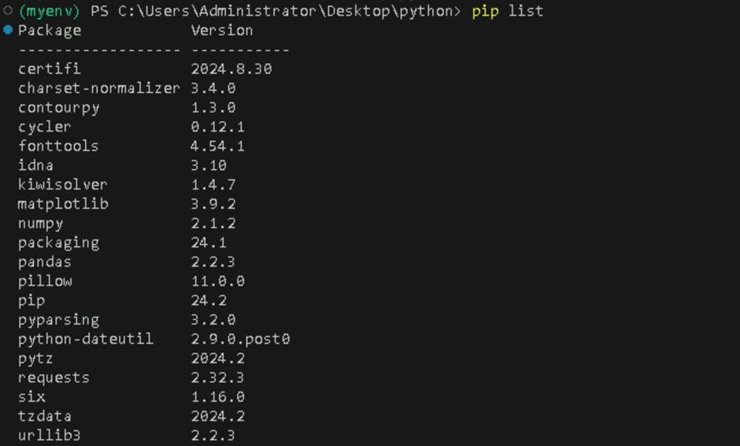

This command will display a list of installed libraries along with their versions.

---


#### **Program 1: Using `requests` Library**

This program fetches the content of a webpage using the `requests` library.

```python
import requests

def fetch_webpage(url):
    """Fetch and return the content of a webpage."""
    response = requests.get(url)
    return response.text

url = "https://www.example.com"
content = fetch_webpage(url)
print(content[:200])  # Print first 200 characters of the webpage content
```

**Output:**

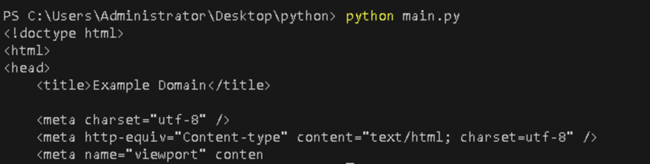

The program uses the `requests.get()` method to fetch the content from a URL.

---

#### **Program 2: Using `matplotlib` Library**

This program creates a simple plot using the `matplotlib` library.

```python
import matplotlib.pyplot as plt

def plot_graph():
    """Plot a simple line graph."""
    x = [1, 2, 3, 4, 5]
    y = [2, 3, 5, 7, 11]
    plt.plot(x, y)
    plt.title('Simple Line Graph')
    plt.xlabel('X-axis')
    plt.ylabel('Y-axis')
    plt.show()

plot_graph()
```

*Note:*

```bash
pip install tk
```
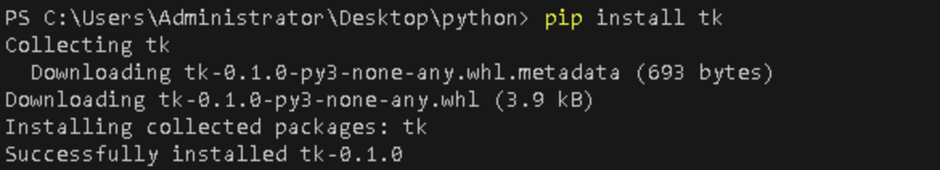

**Output:**

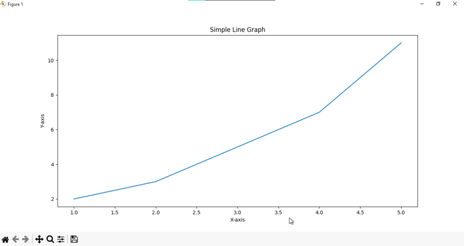

A simple line graph will be displayed with the points plotted for `x` and `y`.

---

#### **Program 3: Using `pandas` Library**

This program demonstrates how to create and manipulate a DataFrame using the `pandas` library.

```python
import pandas as pd

def create_dataframe():
    """Create and return a pandas DataFrame."""
    data = {
        'Name': ['Alice', 'Bob', 'Charlie'],
        'Age': [25, 30, 35],
        'City': ['New York', 'Los Angeles', 'Chicago']
    }
    df = pd.DataFrame(data)
    return df

df = create_dataframe()
print(df)
```

**Output:**

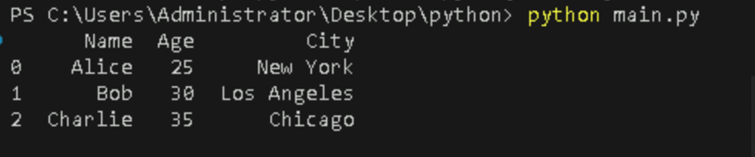

The program creates a simple DataFrame using the `pandas` library and prints it in tabular format.

---

## **References**

- [Python pip Documentation](https://pip.pypa.io/en/stable/)
- [Virtual Environments in Python](https://docs.python.org/3/library/venv.html)
- [Requests Library Documentation](https://docs.python-requests.org/en/latest/)
- [Matplotlib Documentation](https://matplotlib.org/)
- [Pandas Documentation](https://pandas.pydata.org/)

---