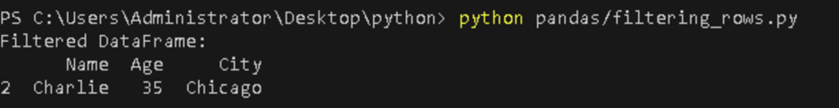

# **Create and Manipulate Arrays and DataFrames using NumPy and Pandas**

## **Table of Contents**

- [**Introduction**](#Introduction)  
- [**Problem Statement**](#problem-statement)  
- [**Prerequisites**](#Prerequisites)
  - [**Software Requirement**](#software-requirement)  
  - [**Hardware Requirement**](#hardware-requirement)  
- [**Implementation Steps**](#implementation-steps)  
   - [**Step-1: Install NumPy and Pandas**](#step-1-install-numpy-and-pandas)  
   - [**Step-2: Create and Manipulate NumPy Arrays**](#step-2-create-and-manipulate-numpy-arrays)
   - [**Step-3: Create and Manipulate Pandas DataFrames**](#step-3-create-and-manipulate-pandas-dataframes)
- [**References**](#references)

---

## **Introduction**

This guide explains how to work with two powerful Python libraries, NumPy and Pandas, to create and manipulate arrays and DataFrames. These libraries are widely used for data manipulation and scientific computing.

---

## **Problem Statement**

Learn how to create and manipulate NumPy arrays and Pandas DataFrames to efficiently handle large data sets, perform computations, and manage tabular data.

---

## **Prerequisites**

### **Software Requirement**

- **Python 3.13.0**  
   [Download Python](https://www.python.org/downloads/)

- **Code Editor**  
   A text editor or IDE like **Visual Studio Code (VS Code)** is recommended.  
   [Download VS Code](https://code.visualstudio.com/Download)
   
- **NumPy and Pandas**: Both libraries installed in your environment.

### **Hardware Requirement**

- **Processor**: Minimum dual-core processor.
- **RAM**: 4GB or more.
- **Storage**: At least 1GB free space for Python and libraries.

---

## **Implementation Steps**

### **Step-1: Install NumPy and Pandas**

Before you can work with NumPy and Pandas, install them using `pip`:

```bash
pip install numpy pandas
```


---

### **Step-2: Create and Manipulate NumPy Arrays**

#### **What is NumPy?**

`NumPy` is a Python library used for working with arrays. It provides support for multi-dimensional arrays and matrices, along with a large collection of high-level mathematical functions to operate on these arrays.

#### **Why do we use NumPy?**

- NumPy arrays are faster and more memory-efficient than traditional Python lists. They are suitable for numerical computations like matrix multiplication, linear algebra, statistical operations, etc.

- Commonly used in scientific computing, machine learning, data analysis, and numerical simulations.

---

#### **Creating NumPy Arrays**

You can create a NumPy array using `np.array()`:

- **Create a new file** 

  - Create a Python file named `np_array.py` inside your `numpy` folder and add the following code.


```python
import numpy as np

# Create a 1D array
array_1d = np.array([1, 2, 3, 4, 5, 6, 7, 8])
print(f"1D Array: {array_1d}")

# Create a 2D array (matrix)
array_2d = np.array([[1, 2, 3], [4, 5, 6]])
print(f"2D Array:\n{array_2d}")
```

- **Run the Python file**  

   Use the command below in your terminal to run the Python file:

```bash
python numpy/np_array.py
```
   Alternatively, you can use:

```bash
cd numpy
python np_array.py
```  


**Output**:  


 
This creates a 1D array and a 2D matrix.

---

#### **Manipulation of NumPy Arrays**

You can perform various operations such as reshaping, indexing, slicing, and mathematical operations on arrays.

#### 1. **Reshaping Arrays**:  

Reshaping allows you to change the dimensions of an array without changing its data. For example, you can convert a flat array into a multi-dimensional array.
   
- **Create a new file** 

  - Create a Python file named `reshape_array.py` inside your `numpy` folder and add the following code.


```python
import numpy as np
# Create a 1D array
array_1d = np.array([1, 2, 3, 4, 5, 6, 7, 8])

# Reshape 1D array to 2D array
reshaped_array = array_1d.reshape(4, 2)
print(f"Reshaped Array:\n{reshaped_array}")
```

- **Run the Python file**  

   Use the command below in your terminal to run the Python file:

```bash
python numpy/reshape_array.py
```

**Output**:  


This converts a 1D array into a 2D array with 4 rows and 2 columns.


#### 2. **Indexing and Slicing**:  

Indexing allows you to access individual elements of an array using their index (position), while slicing lets you extract a subset of elements.
   
- **Create a new file** 

  - Create a Python file named `sliced_array.py` inside your `numpy` folder and add the following code.

```python
import numpy as np
# Create a 1D array
array_1d = np.array([1, 2, 3, 4, 5, 6, 7, 8])

# Accessing elements
element = array_1d[2]
print(f"Element at index 2: {element}")

# Slicing array
sliced_array = array_1d[1:4]
print(f"Sliced Array: {sliced_array}")
```

- **Run the Python file**  

   Use the command below in your terminal to run the Python file:

```bash
python numpy/sliced_array.py
```

**Output**:  


Extracts elements by index and slices the array from index 1 to 3.


#### 3. **Mathematical Operations**:  

NumPy allows you to perform element-wise arithmetic operations (like addition, subtraction, multiplication, and division) on arrays.
   
- **Create a new file** 

  - Create a Python file named `added_array.py` inside your `numpy` folder and add the following code.

```python
import numpy as np
# Create a 1D array
array_1d = np.array([1, 2, 3, 4, 5, 6, 7, 8])

# Adding two arrays
added_array = array_1d + np.array([10, 20, 30, 40, 50, 60, 70, 80])
print(f"Added Array: {added_array}")
```

- **Run the Python file**  

   Use the command below in your terminal to run the Python file:

```bash
python numpy/added_array.py
```

**Output**:  


 
Adds corresponding elements from two arrays.


#### 4. **Sorting NumPy Arrays**

You can sort arrays using the `np.sort()` function.

- **Create a new file** 

  - Create a Python file named `sorted_array.py` inside your `numpy` folder and add the following code.

```python
# Sorting a 1D array
sorted_array = np.sort(array_1d)
print(f"Sorted 1D Array: {sorted_array}")

# Sorting a 2D array
sorted_2d_array = np.sort(array_2d, axis=1)  # Sort each row
print(f"Sorted 2D Array by Rows:\n{sorted_2d_array}")
```

- **Run the Python file**  

   Use the command below in your terminal to run the Python file:

```bash
python numpy/sorted_array.py
```

**Output**:  


 
Sorts the 1D array in ascending order and sorts each row of the 2D array.


#### 5. **Searching NumPy Arrays**

Use the np.where() function to find the index or indices of elements that meet a specific condition in an array.

- **Create a new file** 

  - Create a Python file named `search_array.py` inside your `numpy` folder and add the following code.

```python
import numpy as np
# Create a 1D array
array_1d = np.array([1, 2, 3, 4, 5, 6, 7, 8])

# Find the index of the element that equals 4
search_result= np.where(array_1d == 4)

print(f"Index of the element that equals 4:  {search_result}")
```

- **Run the Python file**  

   Use the command below in your terminal to run the Python file:

```bash
python numpy/search_array.py
```

**Output**:  


 
This identifies the index of the element in array_1d that is equal to 4.


### **Step-3: Create and Manipulate Pandas DataFrames**

#### **What is Pandas?**

Pandas is a Python library that provides high-performance, easy-to-use data structures, particularly for tabular data. The primary structure in Pandas is the DataFrame, which is similar to a table in a database or Excel spreadsheet.

#### **Why do we use Pandas?**

- Pandas simplifies data manipulation and analysis tasks. It provides powerful functions for handling missing data, merging datasets, filtering, and grouping data.

- Pandas is widely used in data analysis, machine learning, and financial analysis.

---

#### **Creating Pandas DataFrames**

You can create a Pandas DataFrame from a dictionary or a NumPy array:

- **Create a new file** 

  - Create a Python file named `creating_dataframe.py` inside your `pandas` folder and add the following code.

```python
import pandas as pd

# Creating a DataFrame from a dictionary
data = {'Name': ['Alice', 'Bob', 'Charlie'],
        'Age': [25, 30, 35],
        'City': ['New York', 'Los Angeles', 'Chicago']}

df = pd.DataFrame(data)
print(f"DataFrame:\n{df}")
```

- **Run the Python file**  

   Use the command below in your terminal to run the Python file:

```bash
python pandas/creating_dataframe.py
```
   Alternatively, you can use:

```bash
cd pandas
python creating_dataframe.py
```

**Output**:  


 
Creates a DataFrame with columns "Name," "Age," and "City."

---

#### **Basic Manipulation of Pandas DataFrames**

#### 1. **Selecting Columns**:  

You can access specific columns in a DataFrame using their names.

- **Create a new file** 

  - Create a Python file named `selecting_column.py` inside your `pandas` folder and add the following code.


```python
import pandas as pd

# Creating a DataFrame from a dictionary
data = {'Name': ['Alice', 'Bob', 'Charlie'],
        'Age': [25, 30, 35],
        'City': ['New York', 'Los Angeles', 'Chicago']}

df = pd.DataFrame(data)
# Selecting a column
age_column = df['Age']
print(f"Age Column:\n{age_column}")
```

- **Run the Python file**  

   Use the command below in your terminal to run the Python file:

```bash
python pandas/selecting_column.py
```

**Output**:  


 
Selects and prints the "Age" column from the DataFrame.


#### 2. **Filtering Rows**:

Filter rows based on a condition.

- **Create a new file** 

  - Create a Python file named `filtering_rows.py` inside your `pandas` folder and add the following code.


```python
import pandas as pd

# Creating a DataFrame from a dictionary
data = {'Name': ['Alice', 'Bob', 'Charlie'],
        'Age': [25, 30, 35],
        'City': ['New York', 'Los Angeles', 'Chicago']}

df = pd.DataFrame(data)
# Filter rows where Age is greater than 30
filtered_df = df[df['Age'] > 30]
print(f"Filtered DataFrame:\n{filtered_df}")
```

- **Run the Python file**  

   Use the command below in your terminal to run the Python file:

```bash
python pandas/filtering_rows.py
```

**Output**:  


 
Filters the DataFrame to show rows where the age is greater than 30.


#### 3. **Adding a New Column**:  

Add a new column to the DataFrame.

- **Create a new file** 

  - Create a Python file named `adding_new.py` inside your `pandas` folder and add the following code.


```python
import pandas as pd

# Creating a DataFrame from a dictionary
data = {'Name': ['Alice', 'Bob', 'Charlie'],
        'Age': [25, 30, 35],
        'City': ['New York', 'Los Angeles', 'Chicago']}

df = pd.DataFrame(data)
# Adding a new column
df['Salary'] = [50000, 60000, 70000]
print(f"DataFrame with Salary Column:\n{df}")
```

- **Run the Python file**  

   Use the command below in your terminal to run the Python file:

```bash
python pandas/adding_new.py
```

**Output**:  


 
Adds a new column "Salary" to the DataFrame.


#### 4. **Calculating Average**:  

Perform aggregation, such as calculating the average of a column.

- **Create a new file** 

  - Create a Python file named `calculating_avg.py` inside your `pandas` folder and add the following code.


```python
import pandas as pd

# Creating a DataFrame from a dictionary
data = {'Name': ['Alice', 'Bob', 'Charlie'],
        'Age': [25, 30, 35],
        'City': ['New York', 'Los Angeles', 'Chicago']}

df = pd.DataFrame(data)
# Calculating the average age
average_age = df['Age'].mean()
print(f"Average Age: {average_age}")
```

- **Run the Python file**  

   Use the command below in your terminal to run the Python file:

```bash
python pandas/calculating_avg.py
```

**Output**:  


 
Calculates the average of the "Age" column.

---

## **References**

- [NumPy Documentation](https://numpy.org/doc/)
- [Pandas Documentation](https://pandas.pydata.org/docs/)

---