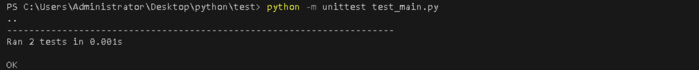

# **Write and Run Unit Tests Using Python’s unittest Framework**

## **Table of Contents**

- [**Introduction**](#Introduction)  
- [**Problem Statement**](#problem-statement)  
- [**Prerequisites**](#Prerequisites)
  - [**Software Requirement**](#software-requirement)  
  - [**Hardware Requirement**](#hardware-requirement) 
- [**Implementation Steps**](#implementation-steps)  
   - [**Create the Python Main File**](#create-the-python-main-file)  
   - [**Write Unit Tests Using unittest Framework**](#write-unit-tests-using-unittest-framework)
   - [**Run the Unit Tests**](#run-the-unit-tests)  
- [**References**](#references)  

---

## **Introduction**

This guide introduces Python's `unittest` framework for writing and running unit tests. Unit testing helps ensure that individual parts (or units) of your code work as expected. The `unittest` framework is built into Python and allows for testing with simple syntax and built-in methods.

---

## **Problem Statement**

Write and execute unit tests in Python using the `unittest` framework to verify that code functions correctly, handle errors, and ensure reliability.

---

## **Prerequisites**

### **Software Requirement**

- **Python 3.13.0**  
   [Download Python](https://www.python.org/downloads/)

- **Code Editor**  
   A text editor or IDE like **Visual Studio Code (VS Code)** is recommended.  
   [Download VS Code](https://code.visualstudio.com/Download)

- **Command Line/Terminal**: For running Python scripts and tests.

### **Hardware Requirement**

- **Processor**: Minimum dual-core processor.
- **RAM**: 4GB or more.
- **Storage**: At least 1GB free space for Python and your project files.

---

## **Implementation Steps**

   
#### **Example 1: Testing add and subtract functions**

##### 1. Create the Python Main File

  Create a new Python file named `main.py` in your project directory. This file will contain the function(s) that you want to test.

```python
def add(a, b):
    """Function to add two numbers."""
    return a + b

def subtract(a, b):
    """Function to subtract two numbers."""
    return a - b
```

This simple file contains functions that can be tested using the `unittest` framework.

---

##### 2. Write Unit Tests Using unittest Framework

Now, create a file named `test_main.py` to write unit tests for the functions in `main.py`. Follow the steps below:

- Import the `unittest` module.
- Create a test class that inherits from `unittest.TestCase`.
- Write individual test methods within the class, starting their names with `test_` to be recognized as test cases.

  - code in `test_main.py`:

```python
import unittest
from main import add, subtract

class TestMainFunctions(unittest.TestCase):
    """Unit test class for testing functions in main.py."""

    def test_add(self):
        """Test case for the add function."""
        self.assertEqual(add(2, 3), 5)  # Test if 2 + 3 equals 5
        self.assertEqual(add(-1, 1), 0)  # Test if -1 + 1 equals 0

    def test_subtract(self):
        """Test case for the subtract function."""
        self.assertEqual(subtract(5, 3), 2)  # Test if 5 - 3 equals 2
        self.assertEqual(subtract(0, 5), -5)  # Test if 0 - 5 equals -5

if __name__ == '__main__':
    unittest.main()
```

- The `unittest.TestCase` provides assertion methods like `assertEqual()`, which checks whether the expected result matches the actual result.
- The test cases use `assertEqual()` to test the `add()` and `subtract()` functions.


##### 3. Run the Unit Tests

Once your tests are written, you can run them using the Python command. Here’s how to run the tests:

- Open the terminal or command prompt.
- Navigate to the directory where `test_main.py` is located.
- Run the tests using the following command:

```bash
python -m unittest test_main.py
```

**Output:**

This will execute the test cases in `test_main.py`, and the results will be displayed in the terminal. If all tests pass, you’ll see an output like this:



`Note:` If a test fails, Python will show an error message along with the reason for failure.

---
#### **Example 2: Testing a String Function**

Let’s add a simple example of testing a function that manipulates strings. Add this function to `main.py`:

```python
def capitalize_word(word):
    """Function to capitalize a word."""
    return word.capitalize()
```

Next, write the unit test for this function in `test_main.py`:

```python
class TestStringFunctions(unittest.TestCase):
    """Unit test class for testing string functions."""

    def test_capitalize_word(self):
        """Test case for capitalize_word function."""
        self.assertEqual(capitalize_word('hello'), 'Hello')  # Test if 'hello' becomes 'Hello'
        self.assertEqual(capitalize_word('python'), 'Python')  # Test if 'python' becomes 'Python'
```

**Run the tests:**

```bash
python -m unittest test_main.py
```


This tests the `capitalize_word` function to check if it correctly capitalizes a given string.

---

#### **Example 3: Testing a List Function**

Here’s another example, this time for a function that works with lists. Add this function to `main.py`:

```python
def get_first_element(lst):
    """Function to get the first element of a list."""
    if lst:
        return lst[0]
    return None
```

Then write a unit test for this function:

```python
class TestListFunctions(unittest.TestCase):
    """Unit test class for testing list functions."""

    def test_get_first_element(self):
        """Test case for get_first_element function."""
        self.assertEqual(get_first_element([1, 2, 3]), 1)  # Test if the first element is 1
        self.assertEqual(get_first_element([]), None)  # Test if an empty list returns None
```

**Run the tests:**

```bash
python -m unittest test_main.py
```


This test checks if the `get_first_element` function returns the correct value from a list or `None` for an empty list.

---

## **References**

- [Python unittest Documentation](https://docs.python.org/3/library/unittest.html)
- [unittest – Python Testing Framework](https://realpython.com/python-testing/)

---