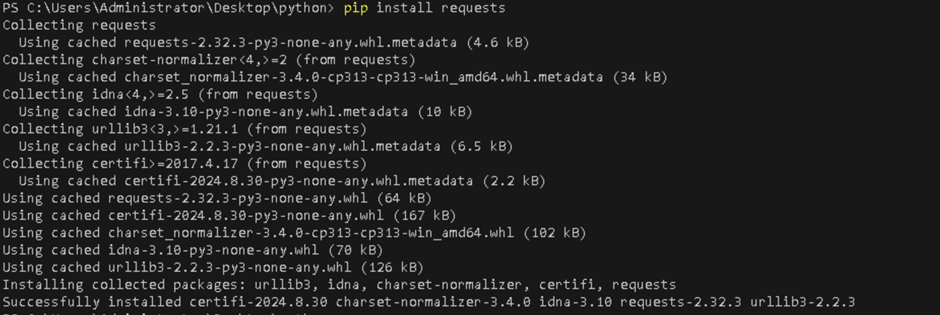
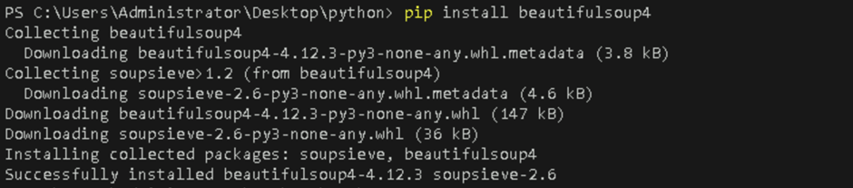
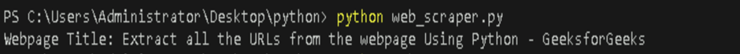

# **Automate a Simple Task (e.g., Web Scraping) Using Python Scripts**

## **Table of Contents**

- [**Introduction**](#introduction)
- [**Problem Statement**](#problem-statement)
- [**Prerequisites**](#prerequisites)
  - [**Software Requirement**](#software-requirement)
  - [**Hardware Requirement**](#hardware-requirement)
  - [**Libraries Required**](#libraries-required)
- [**Implementation Steps**](#implementation-steps)
  - [**Step-1: Set Up Your Python Environment**](#step-1-set-up-your-python-environment)
  - [**Step-2: Write a Python Script for Web Scraping**](#step-2-write-a-python-script-for-web-scraping)
  - [**Step-3: Run and Test the Script**](#step-3-run-and-test-the-script)
- [**References**](#references)

---

## **Introduction**

Automation of repetitive tasks using Python can significantly improve efficiency. One common task to automate is web scraping, where a script extracts data from websites for various purposes, like gathering information or collecting structured data from online sources.

---

## **Problem Statement**

Learn to automate web scraping using Python scripts to extract data from websites. In this example, we'll scrape data from a webpage using the `requests` and `BeautifulSoup` libraries.

---

## **Prerequisites**

### **Software Requirement**

- **Python 3.13.0**  
   [Download Python](https://www.python.org/downloads/)

- **Code Editor**  
   A text editor or IDE like **Visual Studio Code (VS Code)** is recommended.  
   [Download VS Code](https://code.visualstudio.com/Download)

- **Command Line/Terminal**: For running Python scripts.


### **Hardware Requirement**

- **Processor**: Minimum dual-core processor.
- **RAM**: 4GB or more.
- **Storage**: At least 1GB free space for Python and your project files.


### **Libraries Required**

Before proceeding, you need to install some Python libraries that will help with web scraping:

- **requests**: For sending HTTP requests to fetch the webpage content.
- **beautifulsoup4**: For parsing the HTML content and extracting specific data.

Run the following commands in the terminal to install these libraries:

```bash
pip install requests
pip install beautifulsoup4
```




---

## **Implementation Steps**

### **Step-1: Set Up Your Python Environment**

1. **Create a new Python file**: Start by creating a Python script named `web_scraper.py` in your project directory.

2. **Install required libraries**: As mentioned in the prerequisites, install the `requests` and `beautifulsoup4` libraries.

---

### **Step-2: Write a Python Script for Web Scraping**

Add the following code to `web_scraper.py` to scrape and extract data from a webpage:

```python
import requests
from bs4 import BeautifulSoup

def scrape_webpage(url):
    """Scrape the webpage and extract data."""
    try:
        # Send an HTTP request to the URL
        response = requests.get(url)
        # Check if the request was successful (status code 200)
        if response.status_code == 200:
            # Parse the webpage content
            soup = BeautifulSoup(response.content, 'html.parser')
            # Extract and return the webpage's title as an example
            title = soup.title.string
            return f"Webpage Title: {title}"
        else:
            return f"Failed to retrieve data. HTTP Status code: {response.status_code}"
    except Exception as e:
        return f"An error occurred: {e}"


url = "https://www.geeksforgeeks.org/extract-all-the-urls-from-the-webpage-using-python/?ref=lbp"
print(scrape_webpage(url))
```

- **requests.get(url)**: Sends an HTTP request to fetch the content of the webpage.
- **BeautifulSoup**: Parses the HTML content of the page and allows easy access to the data. In this case, we're extracting the title tag content as an example.
- **Error handling**: We use a try-except block to catch and handle potential errors such as connection failures.


---

### **Step-3: Run and Test the Script**

To run the Python script, open your terminal and navigate to the directory where `web_scraper.py` is saved. Then, execute the script by running:

```bash
python web_scraper.py
```

**Output:**



You can modify the script to extract other elements from the webpage, such as headings, paragraphs, or links.

---

## **References**

- [BeautifulSoup Documentation](https://www.crummy.com/software/BeautifulSoup/bs4/doc/)
- [Requests Library Documentation](https://docs.python-requests.org/en/latest/)

---
